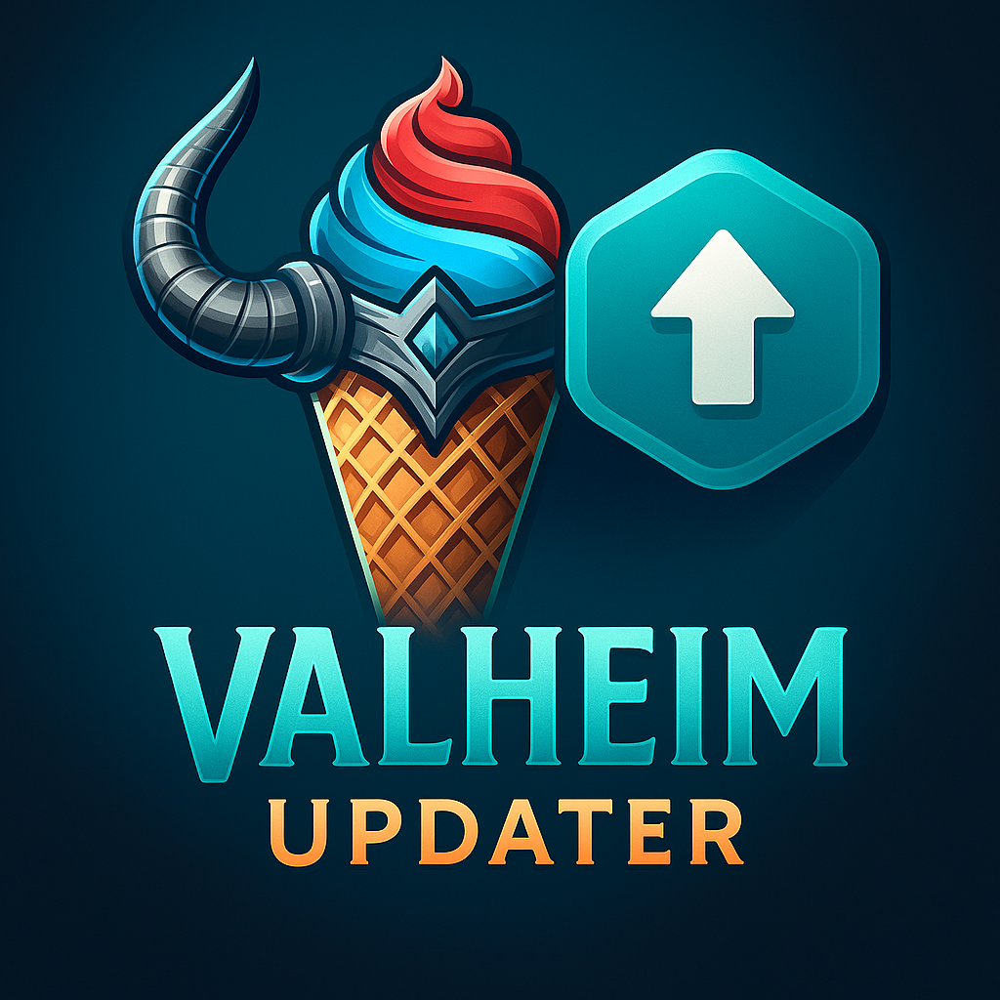

<p align="center">
  
</p>

# Valkream Updater GUI

Une interface graphique moderne et intuitive pour la gestion des mises à jour du jeu Valheim, développée avec Electron.

## 🎮 Fonctionnalités

### Système de Mise à Jour Automatique

- **Vérification automatique** : Contrôle des mises à jour au démarrage
- **Vérification manuelle** : Bouton dédié dans l'interface
- **Téléchargement progressif** : Barre de progression avec vitesse et taille
- **Installation automatique** : Mise à jour transparente

### Gestion des Versions

- **Build de jeux** : Compilation et packaging des versions
- **Build de launcher** : Création d'installateurs
- **Gestion des versions** : Ajout, modification et suppression
- **Upload automatique** : Partage des builds

### Interface Moderne

- **Design responsive** : Interface adaptative
- **Animations fluides** : Transitions et effets visuels
- **Thème sombre** : Interface élégante et moderne
- **Vidéo de fond** : Ambiance immersive

## 🚀 Installation

### Prérequis

- Node.js (version 16 ou supérieure)
- npm ou yarn
- Git

### Installation des Dépendances

```bash
# Cloner le repository
git clone https://github.com/Jean-Chante/Valkream-Updater-GUI.git
cd Valkream-Updater-GUI

# Installer les dépendances
npm install
# ou
yarn install
```

## 🤝 Contribution

1. Fork le projet
2. Créer une branche pour votre fonctionnalité (`git checkout -b feature/AmazingFeature`)
3. Commit vos changements (`git commit -m 'Add some AmazingFeature'`)
4. Push vers la branche (`git push origin feature/AmazingFeature`)
5. Ouvrir une Pull Request

## 📄 Licence

Ce projet est sous licence MIT. Voir le fichier [LICENSE](LICENSE) pour plus de détails.

## 👥 Équipe

- **Valkream Team** - Développement principal

## 🆘 Support

Pour toute question ou problème :

- Consultez la documentation dans le dossier `doc/`
- Vérifiez les logs de l'application
- Ouvrez une issue sur GitHub

---

**Développé avec ❤️ par l'équipe Valkream**
